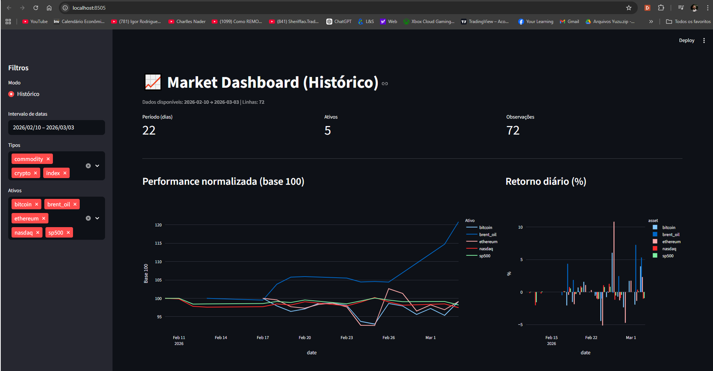

# 📊 Market Data Pipeline & Streamlit Dashboard

End-to-end data engineering mini-project that builds...

## ✅ What this project does

**Assets**
- Crypto: Bitcoin, Ethereum (CoinGecko)
- Markets: Brent Oil, S&P 500, Nasdaq (Yahoo Finance via yfinance)

**Pipeline**
1. **Extract** historical prices (last N days)
2. **Transform** raw history into a unified daily dataset
3. **Load** into SQLite (`asset_daily`)
4. **Visualize** in Streamlit with:
   - Date range filter
   - Asset/asset_type filters
   - Normalized performance (Base 100)
   - Daily returns (%)
   - Price chart + table

## 🏗 Architecture
CoinGecko / Yahoo Finance
↓
scripts/extract
↓
data/raw (json)
↓
scripts/transform
↓
data/processed (csv)
↓
scripts/load
↓
SQLite (data/market.db)
↓
Streamlit (dashboard.py)

## Data Pipeline Architecture

The project follows a modular ETL architecture:

1. Extract
   - Collect historical market data
   - CoinGecko API (crypto)
   - Yahoo Finance via yfinance (indexes and commodities)

2. Transform
   - Convert raw JSON data into a normalized daily dataset
   - Standardize asset names and asset types
   - Calculate derived metrics such as daily returns

3. Load
   - Persist the dataset into a SQLite database
   - Table: asset_daily
   - Composite primary key: (date, asset)

4. Analytics Layer
   - Streamlit dashboard
   - Interactive filters
   - Normalized performance comparison
   - Correlation heatmap
   - Annualized volatility

## 🗃 Database schema

Table: `asset_daily`

| column     | type | description |
|-----------|------|-------------|
| date      | TEXT | YYYY-MM-DD |
| asset     | TEXT | bitcoin, ethereum, brent_oil, sp500, nasdaq |
| asset_type| TEXT | crypto, commodity, index |
| price_usd | REAL | daily close price in USD |

Primary Key: `(date, asset)`

## 🚀 How to run

### 1) Create venv & install dependencies

**Windows (PowerShell)**
```powershell
python -m venv venv
.\venv\Scripts\Activate.ps1
pip install -r requirements.txt